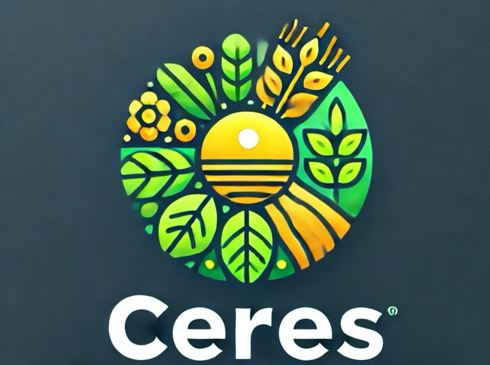

<h1 align="center">
	<br><br>
    Projeto Ceres
</h1>

<div align="center">
    <a href="https://www.typescriptlang.org/">
        
    </a>
    <a href="https://developer.mozilla.org/en-US/docs/Web/JavaScript">
        
    </a>
    <a href="https://www.java.com/">
		
	</a>
	<a href="https://spring.io/projects/spring-boot">
		
    </a>
    <a href="https://react.dev/">
		
    </a>
     <a href="https://www.mysql.com/">
		
    </a>
</div>

## Sumário

<p align="center">
    <a href="#sobre">Sobre</a> •
    <a href="#objetivos">Objetivos</a> •
    <a href="#contribuições">Contribuições</a> •
    <a href="#membros">Membros</a> •
    <a href="#licença">Licença</a>
</p>

## 📌Sobre

<div>
    <p align="center">
    <em>
        Um aplicativo voltado para distribuição e aumento de visibilidade de produtores locais e produtos para agricultores. Preços descentralizados do mercado padrão (idealmente menores) voltados para a população vulnerável das cidades.
        <br><br>
    </em>
    </p>
</div>

## 🎯Objetivos

<div>
    <p align="center">
    <em>
        Estimular a agricultura local, o estímulo para agriculturas orgânicas, evitar o desperdício de alimentos e garantir a qualidade dos mercados de commodities de alimentos.
        <br><br>
    </em>
    </p>
</div>

## Contribuições:

### Documentação:

```
git clone git@github.com:ceres03/docs.git
```

### Frontend:

```
git clone git@github.com:ceres03/frontend.git
```

### Backend:

```
git clone git@github.com:ceres03/backend.git
```

## Membros

<div>
    <p align="center">
        <a href="https://github.com/ceres03/docs/graphs/contributors">Documentação</a> •
        <a href="https://github.com/ceres03/backend/graphs/contributors">Backend</a> •
        <a href="https://github.com/ceres03/frontend/graphs/contributors">Frontend</a>
    </p>
</div>

<div align="center">

|                                                                                       <a href="https://github.com/carolinerinaldo">Caroline</a>                                                                                        |                                                                                       <a href="https://github.com/Guhfrontend">Gustavo</a>                                                                                       |                                                                                      <a href="https://github.com/jovesposito">João</a>                                                                                       |                                                                                       <a href="https://github.com/Juliohf">Júlio</a>                                                                                       |
| :------------------------------------------------------------------------------------------------------------------------------------------------------------------------------------------------------------------------------------: | :------------------------------------------------------------------------------------------------------------------------------------------------------------------------------------------------------------------------------: | :--------------------------------------------------------------------------------------------------------------------------------------------------------------------------------------------------------------------------: | :------------------------------------------------------------------------------------------------------------------------------------------------------------------------------------------------------------------------: |
| <a href="https://github.com/carolinerinaldo"></a> | <a href="https://github.com/Guhfrontend"></a> | <a href="https://github.com/jovesposito"></a> | <a href="https://github.com/Juliohf"></a> |

|                                                                                      <a href="https://github.com/sarassaura">Sarah</a>                                                                                       |                                                                                      <a href="https://github.com/Rojinhas">Ruth</a>                                                                                      |                                                                                        <a href="https://github.com/ouxnq">Vinícius</a>                                                                                        |
| :--------------------------------------------------------------------------------------------------------------------------------------------------------------------------------------------------------------------------: | :----------------------------------------------------------------------------------------------------------------------------------------------------------------------------------------------------------------------: | :---------------------------------------------------------------------------------------------------------------------------------------------------------------------------------------------------------------------------: |
| <a href="https://github.com/sarassaura"></a> | <a href="https://github.com/Rojinhas"></a> | <a href="https://github.com/ouxnq"></a> |

</div>

## 📝Licença

Esse projeto usa a licença [MIT](https://github.com/Yuri-stack/ReadMe/blob/main/LICENSE).

Organização ©ceres, 2024. Todos os direitos reservados.
